# Club Bub

Club Bub is an interactive story creator. It is designed for kids and emulates the behaviour of a real toy called ["Once upon a time" by Clementoni.](https://en.clementoni.com/collections/the-best-loved/products/once-upon-a-time) The original toy is conceived, designed, and developed in Italy.
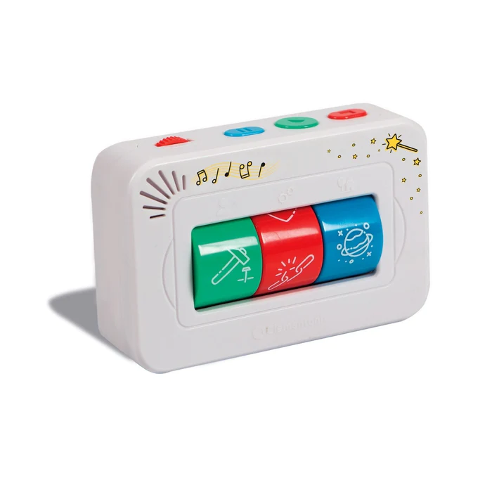

After the login page you'll be presented to the main interface of the game. By clicking on each of the three top buttons displayed, the user will be able to decide the type of character (animal, super hero, astronauts), the type of style (friendship, war, magic), and the type of setting (Space, Nature, City) for the story. Each combination will lead to a different story and a world of fairy tales. The game is an interactive storyteller to create and read up to 27 different stories. At the moment not all stories are available. When stories are unavailable, the text "Story not available" is displayed.

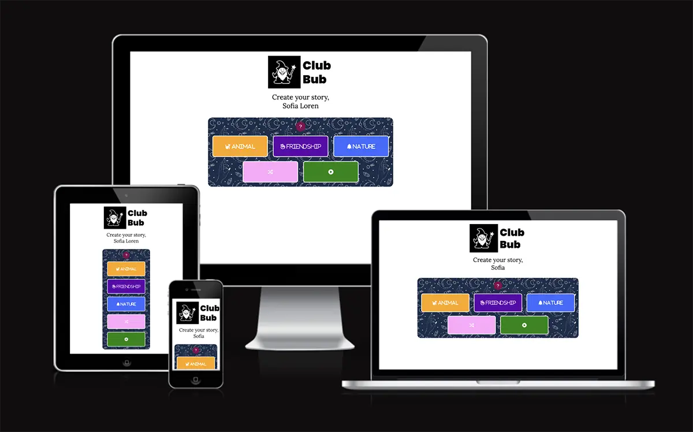

## Development of the idea

### Where the idea comes from

My two daughters got this toy as a present and they still love to play with it. I thought it would be a nice idea to develop a software version of it. Club Bub was born!

- Sketches on paper

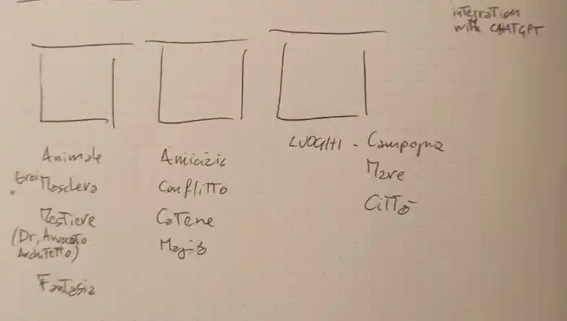
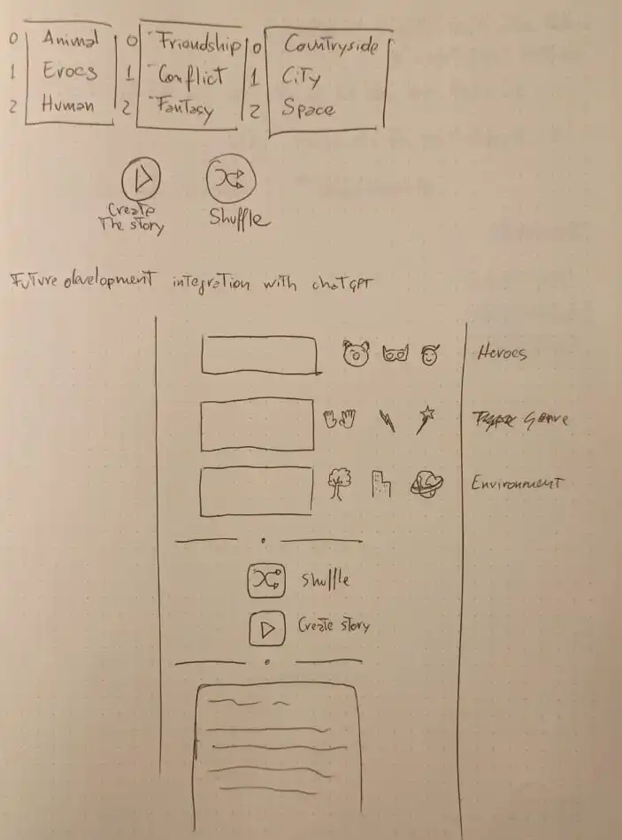
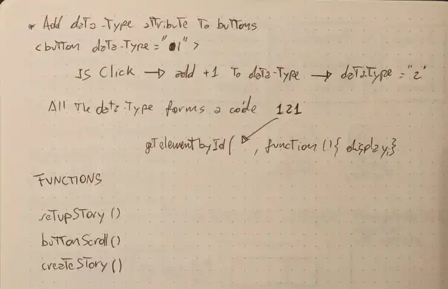

- Logo created starting from a sketch I got from an AI called Dall e 2 and recrafted in Adobe Illustrator

- Color branding and layout research. I was inspired by the color branding of an App called Headspace.

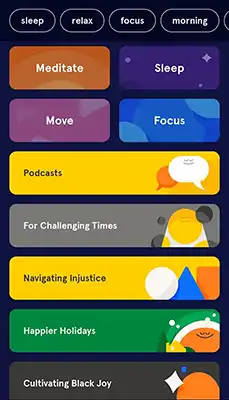

### Features

This website features only one page. The Html is divided into sections that are displayed or hidden according to the user action. The sections are login, wizard, instructions, and story.

- __Login__

  - The login features only one input for username and a button to enter the wizard section. Not providing the username will result in an alert pop-up asking for the input. The input field is used to display the username in the following sections and it's not submitted to any servers. By clicking the enter button, the Story Wizard section is displayed and the login section hidden.
 
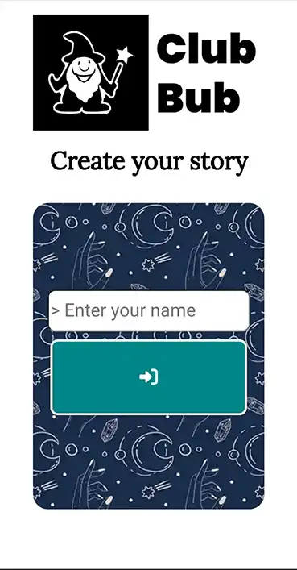

- __Wizard Area__

  - The Wizard Area allows to select the element of the story, and to display it. The Wizard is conceptually divided into three parts: Instructions, Choice Area, and Controls Area. 

    - The instructions button displays the instructions on how to play the game

    

    - _Choice Area_:

      - Character: The user can choose amongst three types of character: Animal, Super-Hero, Human
      - Style: The user can choose amongst three types of style: Friendship, War, Magic
      - Setting: The user can choose amongst three types of settings: Space, Nature, City

      

    - _Controls Area_

    The Controls Area features two buttons: Shuffle and Play
      - The shuffle button creates a random combination of the story elements
      - The Play button displays the story selected according to the choice of the user and hides the Wizard Area

      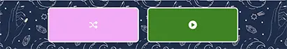

Wizard Area - Mobile Screenshot

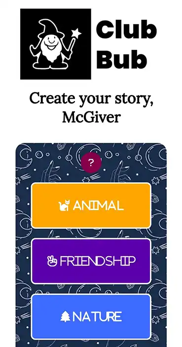

Wizard Area - Desktop Screenshot

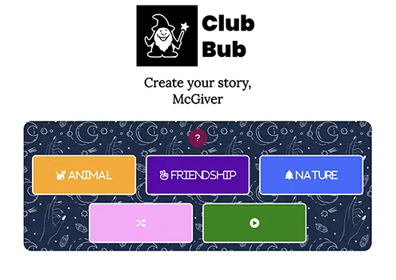

- __Story Area__

  - This area is where the chosen story is displayed and it is revealed after clicking on the play button. It also features a reset button to bring the user back to the wizard area

Story Area - Mobile Screenshot

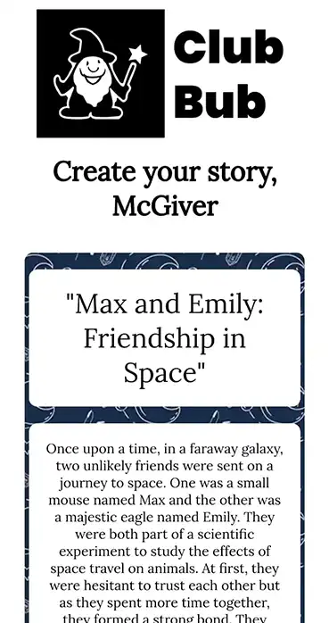

Story Area - Desktop Screenshot

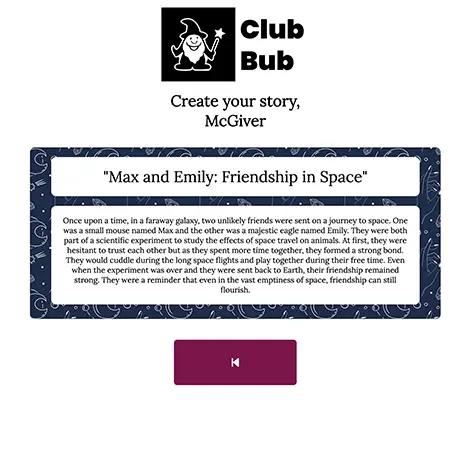

## Testing 

The website has been tested in all its parts and works as intended. It is fully responsive and supports all screen sizes down to 360px. The tests were conducted using the inspector of Google Chrome. It scored high results with Lighthouse both on [Desktop](readme_assets/readme_imgs/lighthouse_desktop.webp) and [Mobile](readme_assets/readme_imgs/lighthouse_mobile.webp).
The elements adapt and change their appearance according to the aspect ratio of the screen without breaking the design.

### Validator Testing 

- JS
  - 25 warning were returned when passing through [JSHint](readme_assets/JSHint_warnings.md)
- CSS
  - No errors were returned when passing through the official [W3C validator](readme_assets/test_screenshots/club-bub_w3cJigSaw.png)
- HTML
  - No errors were returned when passing through the official [W3C CSS validator](readme_assets/test_screenshots/club-bub_w3cvalidator.png)

### Unfixed

- JSHint spotts 3 Undeclared variables which are in reality 3 global variables

## Deployment

- The site was deployed to GitHub pages. The steps to deploy are as follows: 
  - In the GitHub repository, navigate to the Settings tab 
  - On the left menu click on pages
  - On Build and Deployment section select the main branch and click on save.
  - Once saved the url of the page will appear on top of the page. 

The live link can be found here - https://fabi8bit.github.io/clubbub/

## Future development
In the future, Club Bub will be an entirely customizable app in which the user will be able to add custom characters, styles, and settings for the stories. It will utilize the API of chatGPT in order to always have different and fresh stories from AI. It will include a text reader with various types of voices to hear the stories, instead of just reading them.

## Credits 

All the code was written from scratch combining the notion aquired during the lesson and the walkthrough project "Love for Math". Though I researched on line for some code snipet:
- background pattern (https://www.toptal.com/designers/subtlepatterns/watercolor-pattern/)
- pop-up (https://www.youtube.com/watch?v=AF6vGYIyV8M)
- set html attribute using JavaScript (https://www.javascripttutorial.net/dom/attributes/set-the-value-of-an-attribute/)

### Content and technique

- The stories and the name of the project were obtained with ChatGPT (Artificial Intelligence), since the creative and storytelling aspect is not relevant to the scope of this project.
- The icons in the buttons were taken from [Font Awesome](https://fontawesome.com/)
